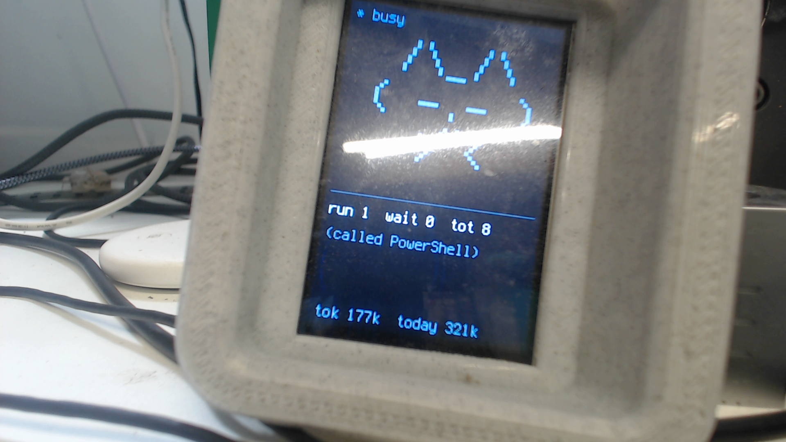

# PyPortal-Claude-Buddy

A desk-pet companion for the **Claude Desktop "Hardware Buddy"**, running on an
**Adafruit PyPortal Titano** — a port of `anthropics/claude-desktop-buddy` (M5StickC) to
the Titano's touchscreen. **18 faithful animated ASCII pets** watch your Claude session
over Bluetooth LE and react across a touch-navigated UI: live run/queued counts, activity,
and token usage; a Tamagotchi-style stats layer (level / mood / energy / fed, persisted to
`nvm`); and tool-permission prompts you **approve or deny with big touch buttons** — plus a
settings menu, demo mode, NeoPixel, and sound + speaker "haptic" feedback.

**Feature parity** with the M5StickC reference: 7 persona states (sleep/idle/busy/attention/
celebrate/dizzy/heart), 18 lazy-loaded species (tap the pet to cycle) with particle overlays,
HOME / PET / INFO / SET screens behind a tab bar, gamification + persistence, demo mode, and
owner/pet-name personalization. (Not ported: GIF custom-character packs; and the IMU-only
shake→dizzy / face-down→nap — the Titano has no IMU.)

```
      /\_/\          * busy
     ( -.- )         run 1  wait 0  tot 8
      >~<            (called PowerShell)
   ----------        tok 97k  today 241k
```

## ✅ Verified working



Connected to the Windows **Claude Desktop "Hardware Buddy"** over BLE, showing live
session state — and, the part that took the most digging, it's **bi-directional**:
tapping APPROVE / DENY on the touchscreen sends the decision back to Claude and the
gated tool call proceeds.

Proven from the device's own console while approving real tool prompts (each `id` is a
live Claude permission-request UUID):

```
[  9.16] [touch] APPROVE id=70228bad-01f9-4b67-a855-e5eb5661a33b
[136.73] [touch] APPROVE id=288907d8-3306-422e-9432-c4a719718940
```

Each tap emitted `{"cmd":"permission","id":"…","decision":"once"}` over Nordic UART, and
the permission-gated tool call **completed instead of timing out**. (It used to hang on
"no response" because the decision was mislabeled `"ack"` instead of `"cmd"` — see
[Wire protocol](#wire-protocol--uart0-one-json-object-per-line-n-framed).)

## Why this exists (the BLE backstory)

The Titano's radio is an on-board **ESP32 (NINA-W102)**. Stock, it runs Adafruit's
`nina-fw` and is reached from CircuitPython via `_bleio` over an HCI-UART link. That
path is **peripheral-only, cannot pair/bond, and does not expose the Generic
Attribute / Service-Changed service** that **Windows WinRT GATT** requires (the
Claude desktop app uses Chromium Web Bluetooth → WinRT). Net effect: a *phone* could
connect, but **Windows could not discover the GATT services** — independently
confirmed against the Claude app logs and raw WinRT (`tools/winrt_gatt.py`).

The fix: **replace `nina-fw` with native ESP32 firmware** (Bluedroid) that runs a
real Nordic UART Service GATT server. WinRT discovery then works. The ESP32 becomes a
pure BLE radio bridged over UART; the **SAMD51 is the brain** (CircuitPython UI + the
wire protocol). Trade-off: WiFi is gone with `nina-fw` — a restore image is included.

## Architecture

```
Claude Desktop  (Windows · WinRT / Web Bluetooth)
      │   BLE — Nordic UART Service  6E400001-…  (RX 6E400002 write, TX 6E400003 notify)
      ▼
ESP32 NINA-W102 ── native Bluedroid firmware (esp32fw/) ───┐   the RADIO
      │   UART0 @115200, newline-framed JSON                │
      ▼                                                     │
SAMD51 ── CircuitPython · buddy_ui.py  (→ D:\code.py) ──────┘   the BRAIN
      ├─ 3.5" 320×480 HX8357 TFT (portrait) — pet + status + approval panel
      ├─ resistive touch — APPROVE / DENY
      └─ speaker (simpleio.tone) — chimes + low-frequency "haptic" thud
```

## Hardware
- **Adafruit PyPortal Titano** (#4444): SAMD51J20 main MCU + ESP32 (NINA-W102) radio,
  3.5" 320×480 HX8357 parallel TFT, resistive touch, mono speaker + amp.
- **CircuitPython 10.0.3** on the SAMD51 (`CIRCUITPY` mounts as `D:`).

## Repository layout
```
flash/                 # what runs on the device (deploy.ps1 copies buddy_audio + every bud_*.py + buddy_ui→code.py)
  buddy_ui.py          #   THE app → D:\code.py  (orchestrates; display/touch/loop)
  bud_proto.py         #   wire protocol: status ack, heartbeat→state, permission send, owner/name
  bud_stats.py         #   gamification + microcontroller.nvm persistence + settings bit-flags
  bud_screens.py       #   screen geometry + hit-tests (approval/tab/menu) + particle overlays
  bud_species.py       #   lazy species loader (one resident at a time)
  bud_species_<name>.py#   per-species pose DATA (cat, dragon, owl, robot, … 18 total)
  buddy_audio.py       #   audio/haptic (from the NEAR Pulse AudioManager)
  boot.py / buddy.py / run_bridge.py / passthrough.py / chunkflash.ps1   # flashing & bring-up utilities (NOT runtime)
esp32fw/               # native ESP32 BLE firmware (PlatformIO · Arduino/Bluedroid) — the radio
  src/main.cpp         #   NUS GATT server + UART0 bridge
  platformio.ini       #   env:nina  (board=esp32dev, huge_app partitions)
tests/                 # host pytest over the import-pure modules (no hardware needed)
  test_proto / test_stats / test_screens / test_species .py
tools/                 # host-side helpers (PowerShell + Python)
  deploy.ps1           #   copy runtime modules to D: (buddy_ui→code.py last); auto-reload applies
  cam.py               #   grab one webcam frame → cam.jpg (visual verification)
  drive.py             #   act as a synthetic Claude desktop over BLE (drive heartbeats/prompts)
  serial_log.py        #   log the SAMD51 console (COM7): boot prints, [stats], tracebacks
  winrt_gatt.py / scan_ble.py / round_trip.py / status_test.py / probe_connect.py  # BLE bring-up tests
nina_w102_restore.bin  # nina-fw 3.3.0 image — flash at 0x0 to restore WiFi
PROGRESS.md            # build log / status / recovery notes
```

## Reproduce from scratch

### Prerequisites (host, Windows)
- `esptool` (`pip install esptool`), `PlatformIO` (`pip install platformio`), `bleak` (for tests).
- CircuitPython 10.x already on the Titano (`D:` = `CIRCUITPY`).

### 1 — Build & flash the native BLE firmware onto the ESP32
```powershell
# build
cd esp32fw ; pio run            # → .pio/build/nina/{bootloader,partitions,firmware}.bin

# put the SAMD51 into "flash jig" mode (creates COM8, holds ESP32 in ROM bootloader)
Copy-Item flash\boot.py        D:\boot.py   -Force
Copy-Item flash\passthrough.py D:\code.py   -Force      # hard-reset / re-save to apply

# flash the small images directly over COM8 (they fit under the bridge's ~17 KB limit)
esptool --chip esp32 --port COM8 --before no-reset --after no-reset --no-stub --baud 115200 `
  write-flash 0x1000 .pio\build\nina\bootloader.bin 0x8000 .pio\build\nina\partitions.bin

# flash the big firmware in 16 KB chunks (the CircuitPython bridge drops large writes)
.\..\flash\chunkflash.ps1       # firmware.bin @ 0x10000, retries any failed chunk
```
Verify from Windows: `python tools\winrt_gatt.py` → should report **SUCCESS_NUS**
(3 services incl. Nordic UART `6E400001` with RX `…02` + TX `…03`).

### 2 — Install the buddy on the SAMD51 (CircuitPython)
Required libraries in `D:\lib/` (Adafruit CircuitPython 10.x bundle):
`adafruit_display_text`, `adafruit_display_shapes`, `adafruit_touchscreen`,
`adafruit_hx8357` (built into the board), and `simpleio` (for audio tones).
```powershell
Copy-Item flash\buddy_audio.py D:\buddy_audio.py -Force
Copy-Item flash\buddy_ui.py    D:\code.py        -Force
Remove-Item D:\boot.py -ErrorAction SilentlyContinue   # COM8 only needed for reflashing
# or just: tools\deploy.ps1
```
On boot the SAMD51 resets the ESP32 into run mode, opens `busio.UART(board.ESP_TX,
board.ESP_RX)`, plays a startup chime, and shows the pet.

### 3 — Connect from Claude Desktop
Open the **Hardware Buddy** panel and connect to **`Claude-PyPortal`**. The device
answers the app's `{"cmd":"status"}` polls (keeping the link alive) and starts
receiving live heartbeats. Live token counts on screen = connected.

## Wire protocol  (UART0, one JSON object per line, `\n`-framed)

| Direction | Message | Purpose |
|---|---|---|
| app → device | `{"cmd":"status"}` | liveness poll |
| device → app | `{"ack":"status","ok":true,"data":{"name":"Claude-PyPortal","sec":true,"sys":{"up":<s>}}}` | poll reply (required, or the app disconnects) |
| app → device | `{"total":N,"running":N,"waiting":N,"tokens":N,"tokens_today":N,"msg":"…","prompt":{…}}` | heartbeat → drives the UI |
| app → device | `prompt` = `{"id":"…","tool":"…","hint":"…"}` | a pending tool-permission request |
| device → app | `{"cmd":"permission","id":"<id>","decision":"once"}` / `"deny"` | APPROVE / DENY tap |

State mapping: `waiting>0 → attention` (red) · `running>0 → busy` (blue) · else `idle`
(green) · no data >8 s → `disc` ("zzz waiting for claude", sleepy face).

## Touch calibration
`adafruit_touchscreen` is rotation-blind, so the buddy reuses the Titano's proven
**landscape** calibration `((5200,59000),(5800,57000))`, `size=(480,320)`, then rotates
the point into portrait itself:

```
px = ly          # TOUCH_SWAP = True
py = 480 - lx     # TOUCH_FLIP_Y = True   (TOUCH_FLIP_X = False)
```

To recalibrate on different glass: set `TOUCH_DEBUG = True` near the top of
`buddy_ui.py`, redeploy, tap a known target, and read the on-screen `t lx,ly>px,py`
line (a pink marker also drops where you tap). Adjust the SWAP / FLIP flags until the
marker tracks your finger, then set `TOUCH_DEBUG = False`.

## Audio / "haptic"
There is no vibration motor — `buddy_audio.py` fakes tactile feedback with a quick
low-frequency speaker thud. It requires `board.SPEAKER_ENABLE` driven HIGH (handled)
and uses `simpleio.tone()`. Cues: startup power-up chime · coin `beep` on a new prompt
· thud on every tap · 1-up `success_chime` on APPROVE · descending `error_buzz` on DENY.

## Restore / undo
- **WiFi (nina-fw 3.3.0):** with the passthrough running (step 1), flash
  `nina_w102_restore.bin` at `0x0`. It's 1.33 MB → use the chunked approach (or the
  more reliable Arduino `SerialESPPassthrough` route for big writes). This removes the
  native BLE firmware.
- **Back to the NEAR Pulse app:** copy `D:\pulse_code_backup.py` → `D:\code.py` and
  delete `D:\boot.py`.

## Credits
Ported from Anthropic's `claude-desktop-buddy` (M5StickC). Audio, touch-debounce, and
the backlight-screensaver patterns were lifted from the author's **NEAR Pulse** app
(`D:\pyportal_pulse/`), which had already solved these on the same Titano hardware.
